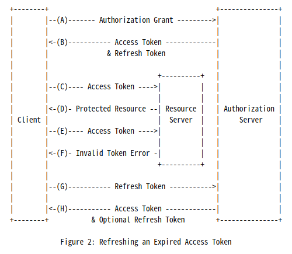

<p align="center">
    <h1 align="center">
        Simple Oauth2.0 
    </h1>
    <p align="center">간단한 Oauth2.0 서비스입니다. grantType은 PKCE만 지원합니다<a href="https://github.com/dimsssss/simple-oauth"></a>.</p>
</p>

<p align="center">
    <a href="">
        
    </a>
    <a href="">
        
    </a>
    <a href="https://expressjs.com/">
        
    </a>
    <a href="https://jestjs.io/">
        
    </a>
    <a href="https://sequelize.org/">
        
    </a>
    <a href="https://dl.circleci.com/status-badge/redirect/gh/dimsssss/simple-oauth/tree/main">
        
    </a>
</p>

## 🔍 프로젝트 내용

### Oauth

소셜로그인을 구현할 때 내부적으로 Oauth를 활용한다는 것을 알고 있었지만 구체적으로 어떤 것을 만들어야하는지 불분명했다

Oauth가 어떤 것인지 알아야되겠다고 생각이 들어서 RFC문서를 확인해보았다.

<table>
    <tr>
        <td>
            
        </td>
        <td>
            
        </td>
    </tr>
    <tr>
        <td>
            
        </td>
        <td>
            
        </td>
    </tr>
</table>
다행히 그림으로 잘 정리되어 있어서 어떤식으로 동작하는지 이해가 되었다. grantType이 Authorization_code(PKCE)인 경우 크게 2가지로 나눌 수 있다. 첫번째는 client에 code를 부여하는 것과 두 번째로 발급한 code에 access token을 발급해주는 것이다.

code를 발급해주는 과정에서 먼저 Authorization 서버에 client가 등록되어 있어야 한다. 해당 요청이 등록된 client인지 확인하고 맞다면 code를 발급해준다. PKCE는 여기서 더 나아가서 토큰 발급을 요청할 때 그 요청이 유효한지 인증하기 위해 code_verifier를 request에 넣는다. 서버측은 이 값을 가지고 token을 발급하는 API에서 적절한 요청인지 확인하는 과정을 거치고 유효하면 토큰을 발급한다

### Token 종류

이 프로젝트에서 JWT를 사용하기로 결정했다. Access Token을 사용하면 발급한 **토큰을 저장**하고 확인을 해야하는 추가 작업이 필요하다. 민감한 데이터를 저장하고 관리하는 비용을 최대한 줄이는게 여러 측면에서 좋아보인다

**Access Token**

Oauth2.0의 스펙을 따르는 토큰. 불투명 토큰이라고 하는데 클라이언트가 토큰을 짐작할 수 없게 하기 때문이다. 토큰 관리를 클라이언트가 하게 하지 않는다.

**ID Token**

[OpenID Connect(OIDC) 사양](https://openid.net/specs/openid-connect-core-1_0.html)을 준수하는 token이다. Access Token과의 가장 큰 차이점은 어플리케이션에서 토큰을 관리하게 한다. [ID Token은 검증하는 과정](https://developers.google.com/identity/protocols/oauth2/openid-connect#validatinganidtoken)을 클라이언트가 처리해야하는 단점이 있다.

**자체 서명** **JWT**

이 토큰을 사용하면 token validation을 위해 인증 서버에 accessToken을 요청하지 않아도 되는 장점이 있다.

[JWT.IO](https://jwt.io/)

## ERD


## 🌐 API Document

https://app.swaggerhub.com/apis-docs/dimsssss/simple-oauth_api/1.0.0

## 🧾 실행

```shell
npm run dev
```
